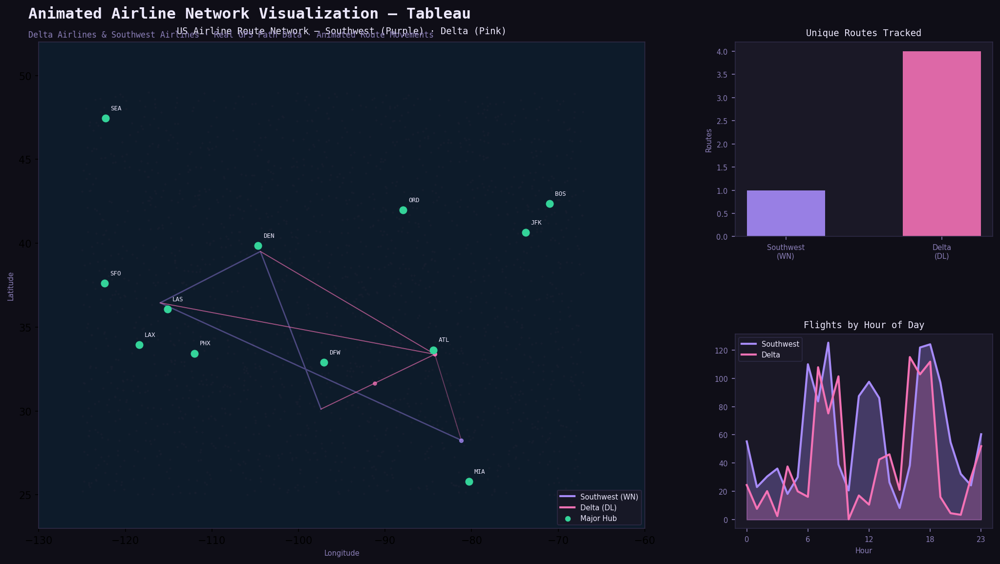

# Animated Airline Network Visualization — Tableau ✈️

> Animated flight path visualization for Delta and Southwest Airlines across the US — real GPS route data, network model, and dawn-to-dusk movement animation.

**Built by [Darsh Jogani](https://www.linkedin.com/in/darsh-jogani-37b97218b)** | MS Business Analytics & AI, UT Dallas

## Overview
Advanced Tableau animated visualization built on real flight tracking data. Models airline route networks as animated paths across a US map, showing flight movements from dawn to dusk. Demonstrates interpolated path animation, network graph design, and temporal data storytelling in Tableau.

## Visualizations
- **Airline Network Model** — full route network for both carriers
- **Delta Airlines: A Day in the Skies** — animated Delta flight movements
- **From Dawn to Dusk: Southwest Airlines Flight Movements** — animated Southwest coverage

## Data
- `interpolated_flight_paths.csv` — GPS-interpolated route segments (260 routes)
- `cleaned_flight_data.csv` — full flight tracking data with timestamps and coordinates

## Key Techniques
- Path animation using Tableau Pages shelf
- Interpolated coordinate sequencing for smooth flight paths
- Network graph layout on geographic map
- Temporal filtering for dawn-to-dusk animation

## Tech Stack
Tableau Desktop · Pages Shelf Animation · Geographic Maps · Path Marks · GPS Data

## Open the Workbook
Download `Airline_AnimatedViz_DarshJogani.twbx` and open in Tableau Desktop (animation requires desktop version).

---
🔗 [Portfolio](https://darish999.github.io/Darshjogani.github.io/) · [LinkedIn](https://www.linkedin.com/in/darsh-jogani-37b97218b) · [GitHub](https://github.com/Darish999)
